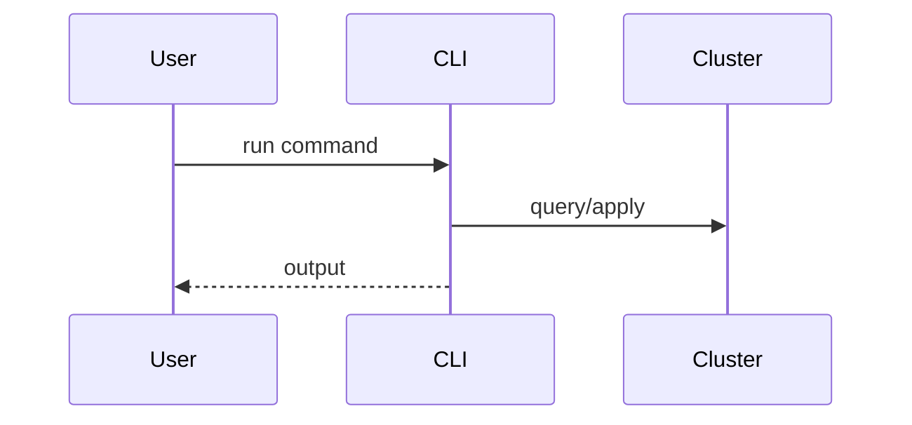

## Highlights

- User-visible outcome.
- Reviewer-visible risk hotspot.

> [!IMPORTANT]
> Use only when approval needs explicit attention (breaking behavior, migration, or rollback risk).

## What Changed

- Technical changes by component/module.

## How to Validate

```bash
make clean
make build
make test
```

## Risks

- Operational risk:
- Data/compatibility risk:

## Rollback

- Revert commit(s):
- Runtime mitigation:

## Optional Diagram



