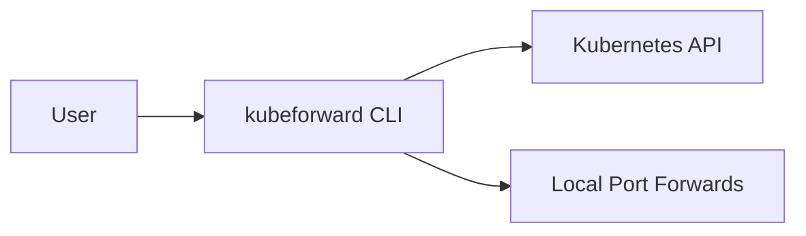

<details>
<summary>Table of contents</summary>

- [Highlights](#highlights)
- [Breaking Changes](#breaking-changes)
- [How to Use](#how-to-use)
- [Changed](#changed)
- [Fixed](#fixed)
- [Artifacts](#artifacts)
- [Full Changelog](#full-changelog)
</details>

## Highlights

- User-visible capability or behavior now available.
- Activation path users can execute immediately.

> [!NOTE]
> Optional. Keep to high-signal context only.

## Breaking Changes

- None.

## How to Use

```bash
kubeforward help
kubeforward plan --config kubeforward.yaml --env dev
```

## Changed

- Item with migration or behavior details.

## Fixed

- Item with issue/PR reference.

## Upgrade Notes

- Required upgrade step(s), if any.
- Rollback caveat(s), if any.

## Artifacts

- `kubeforward-<version>-darwin-<arch>.tar.gz`
- `kubeforward-<version>-darwin-<arch>.tar.gz.sha256`

## Concept Diagram (Optional)



## Full Changelog

- Compare link: `https://github.com/<owner>/<repo>/compare/<prev>...<current>`
