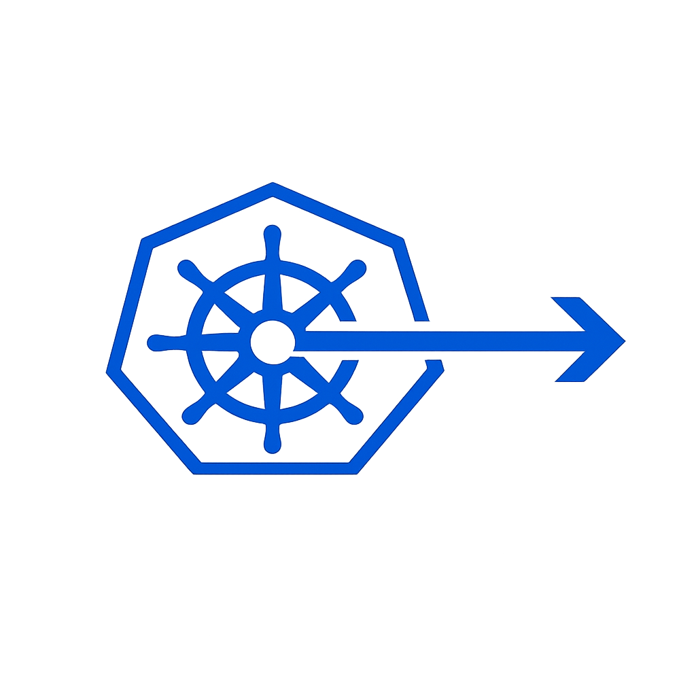

<p align="center">
  
</p>

# kubeforward

Kubeforward is a macOS-first CLI for config-driven Kubernetes port-forward workflows.

Current implementation status: config loading/validation, `plan`, `up`, and `down` are implemented.

## Quick Start

```bash
brew install fcrozetta/tools/kubeforward
kubeforward help
kubeforward plan --file kubeforward.yaml
kubeforward up --file kubeforward.yaml --env dev --daemon
kubeforward down --file kubeforward.yaml --env dev
```

- `help` shows global command usage.
- `plan` validates config and renders a normalized environment/forward summary.
- `up` starts all forwards in the selected environment.
- `down` stops tracked forwards for one environment or all environments.

## Minimal Config

Create `kubeforward.yaml` at repo root:

```yaml
version: 1
metadata:
  project: demo-project
defaults:
  namespace: default
  bindAddress: 127.0.0.1
environments:
  dev:
    forwards:
      - name: api
        resource:
          kind: deployment
          name: api
        ports:
          - local: 7000
            remote: 7000
```

Then run:

```bash
kubeforward plan --env dev
```

## Command Reference

- `kubeforward help`
- `kubeforward --version`
- `kubeforward plan [-f|--file <path>] [-e|--env <name>] [-v|--verbose]`
- `kubeforward up [-f|--file <path>] [-e|--env <name>] [-d|--daemon] [-v|--verbose]`
- `kubeforward down [-f|--file <path>] [-e|--env <name>] [-d|--daemon] [-v|--verbose]`

Notes:
- Unknown environments fail fast.
- Schema errors are reported with contextual paths.
- Duplicate local ports within an environment are rejected.
- `up` without `--daemon` stays attached in the foreground until a forward exits or the user stops it.

## Config Reference

Full schema and validation details: [`docs/config-schema.md`](docs/config-schema.md)

## Maintainer Docs

Build/test/release/maintenance workflows live in [`docs/maintainer.md`](docs/maintainer.md).
